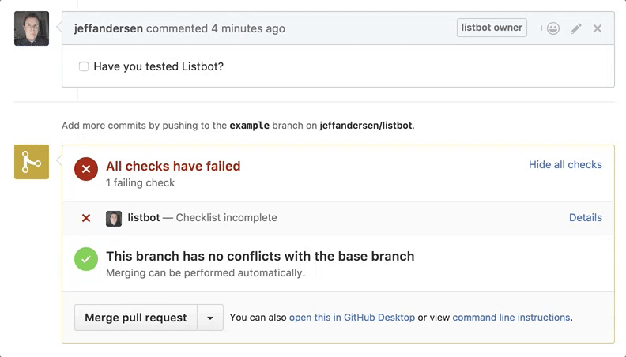

# listbot

Automatically add a checklist to every Pull Request which is opened.

The bot will set the build status to failure until the checklist has been completed.

## Installation

1. Generate a [personal access](https://github.com/settings/tokens) token from Github
 - It must have `repo` and `repo:status` for scopes
2. Signup for [Torus](https://torus.sh) if you haven't already
3. Run `torus link` in your checkout of the code
4. Create an environment for Heroku `torus envs create heroku`
5. Create a machine role for your deployment `torus machines roles create heroku`
6. Give your machine role read only access `torus allow rl /$org/$project/heroku/default/*/*/* heroku`
7. Create a new machine for your deployment with `torus machines create heroku-instance -r heroku`
8. Store the token as `GITHUB_TOKEN` using `torus set -e heroku GITHUB_TOKEN [token]`
9. Click the Heroku deploy button
10. Add values for `TORUS_TOKEN_ID`, `TORUS_TOKEN_SECRET` from step 7 and `TORUS_PROJECT`, `TORUS_ORG` from step 3.
11. Add a new file to your repository at `.github/listbot.md`
12. Add a new webhook at `https://github.com/[owner]/[repo]/settings/hooks/new`
 - Set the payload url to `[hostname]/webhook` where `[hostname]` is the deployed service
 - Select `Issue comment` and `Pull request` from "Let me select individual events"
 - Mark it as active and save
